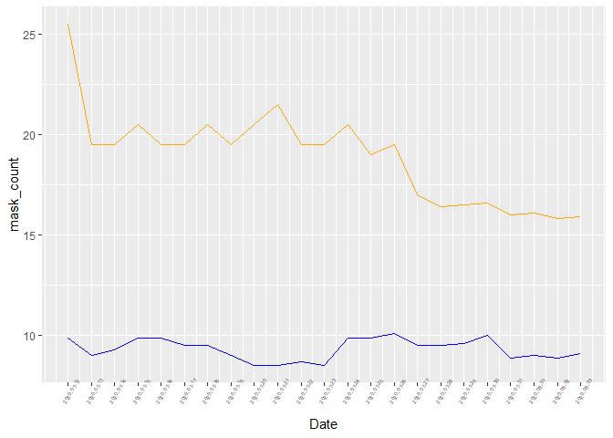

Lab 06 - Conveying the right message through visualisation
================
1_1

### Load packages and data

``` r
library(tidyverse) 
library(lubridate)
library(ggplot2)
```

### Exercise 1

``` r
date = seq(mdy("7/12/2020"),mdy("8/3/2020"),by = 'days')
mask_count = c(25.5,19.5,19.5,20.5,19.5,19.5,20.5,19.5,20.5,21.5,19.5,19.5,20.5,19,19.5,17,16.4,16.5,16.6,16,16.1,15.8,15.9)
no_mask_count = c(9.9,9,9.3,9.9,9.9,9.5,9.5,9,8.5,8.5,8.7,8.5,9.9,9.9,10.1,9.5,9.5,9.6,10,8.9,9,8.9,9.1)
df <- data.frame(date,mask_count,no_mask_count)
view(df)
```

### Exercise 2

``` r
ggplot(df, aes(x = date, y = mask_count))+
  geom_line(aes(y = mask_count), colour = "orange") +
  geom_line(aes(y = no_mask_count), colour = "blue") +
  labs(x = "Date")+
  theme(axis.text.x = element_text(size = rel(0.5),angle = 60)) +
  scale_x_continuous(breaks = date)
```

<!-- -->

### Exercise 3

*Add your narrative here.*

### Exercise 4

*Add your narrative here.*
